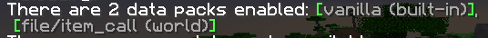
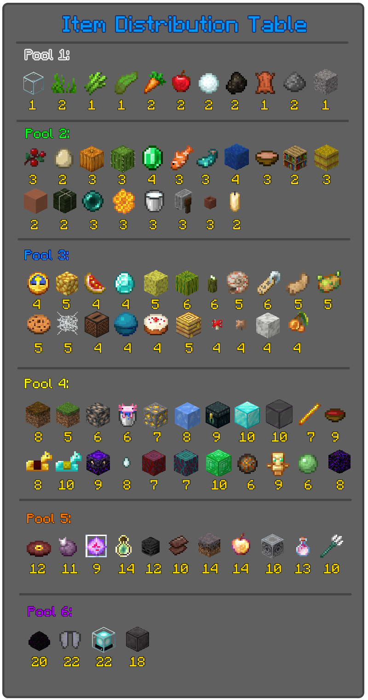

---

## Table of contents

- [Intro](#Intro)
- Getting started
	- [Installation](#Installation)
	- [Configuring](#Configuration)
	- [Starting](#Starting)
- [Gameplay](#Gameplay)
	- [Items](#Items)
- [Credits](#Credits)
- [Licensing](#Licensing)

## Intro

Whether you're on your own, or you're racing a bunch of friends or complete internet strangers, Itemcall is a custom survival gamemode all about finding random items as fast as you can. Race yourself for the fastest time, or race other players and try to beat your opponents for the most points! With a unique permission system, this game requires no players to be opped, and only one person with permissions to do the configuring, making it a great choice for playing with friends or complete internet randos! Ready to get to racing? Read on below!

## Getting started

This is a datapack that's been designed for Vanilla Minecraft 1.18/1.19. While possible to get running on modded servers, it may be in your best interest to install on a vanilla server. Installing alongside plugins such as Essentials may break this datapack!

What you'll need:
- Minecraft singleplayer/LAN world or vanilla server running 1.18/1.19
- Basic ability to manipulate files
- Ability to read instructions (I mean, you made it this far, right?)

### Installation

1. Access the world folder you intend to install Itemcall to. (You can do this by either manually navigating to the folder or, from the world selection screen, select your world, click "Edit", then "Open world folder")
2. Inside, locate your "datapacks" folder, if one does not exist, create one.
3. Extract the contents of the .zip file you downloaded from the [Releases](https://github.com/Mahlarian/itemcall/releases) so that "item_call" exists in the datapacks folder.
4. Confirm that the path "../world/datapacks/item_call/.." exists.

### Configuration

Once you've followed the install instructions above, you can confirm that the datapack is installed correctly before moving on using `/datapack list`  

Itemcall has an abundance of settings you can choose to edit to change things such as game length and win conditions. Before customizing however, you'll need to grant yourself permission. Confirm you have op (or cheats enabled), then run the command `/tag @s add ic_op`. You may replace `@s` with a player name to grant other players permission. Now you can run the command `/trigger ic_menu` to change settings. We'll cover those now.

---

**Win condition** (points/rounds)  
*Default: Points*

**Points**: X amount of points is required to be obtained by a player before winning the game  
**Rounds**: X amount of rounds will be played; whichever player has the most points at the end will win

---

**Rounds/Points needed** (1 - 999)  
*Default: Points=15 / Rounds=5*

The amount of points needed or rounds to be played before a winner is chosen and the game has ended

---

**Show points** (On/Off)  
*Default: On*

Should a scoreboard be displayed on the right hand side of the screen with player scores

---

**Random Spawn** (On/Off)  
*Default: On*

Should players be teleported away from the spawn point or wherever they are located at the start of the game

---

**Spread players** (On/Off)  
*Default: On*

Should players be spread apart from each other at the start of the game? Note that if this and random spawn are on, that random spawn will occur first, then players will be spread out centralized at where they were located.

---

**Anti-hoard mode** (On/Off)  
*Default: On*

Anti-hoard mode changes the survival element a bit. It's a solution to the problem of players holding a bunch of items in their inventory to score free points. This also adds a new challenging element to traditional survival, which helps spice the game up. Enabling this will disable all slots except armor and your hotbar.

---

**Skip round voting** (Players/IC Op Only)  
*Default: Players*

Dictates who can initiate a vote to skip a round. If set to player, the game will be paused while players will have a limited amount of time to decide if they want to skip the round. Each player may call a vote to skip a round once per round. Votes require 50% or more of players in order to pass. If set to IC Op only, any player with IC OP can immediately skip a round. To disable round skipping entirely, set to IC OP and ensure no other players have access to IC OP.

---

### Starting

When ready to start the game, IC ops may initiate the game through the settings menu by clicking "Start game". If there are any players who have not chosen a team by now, they will be prompted to join one. If they still have not chosen a team after 30 seconds, they will automatically be placed on the spectator team. Players on the spectator team will need to wait until next game before participating. Players at any time before the start of the game may switch their team via the `/trigger ic_jointeam` command.

## Gameplay

The game starts with a quick dynamic tutorial briefing players on how to play Itemcall and their overall goal. The game will run until either a player has reached the point requirement, or X rounds has passed (Depending on your decision set in the configuration). Each round, a random item will be drawn from an item pool and announced globally. All players are tasked with fetching the same item, and whoever finds the item first will be rewarded the points. In the event of a tie, all players who found the item will receive points. 

Rounds are balanced around Vanilla progression, so items from late game will not show up in early rounds. For specifics, you may refer to the chart below for item distribution and their point values.

In the event an item is drawn, a vote can be called by players through the `/trigger ic_vote` command. This command is locked from non IC op players if chosen in the configuration, and the round will be skipped immediately in the event the IC op decides to skip the round. Players will have a limited amount of time to vote, and the vote will only pass if enough players vote "Yes". Note that you only need to take action if you agree to skip the round.

The game will end once either a player has reached the point goal, or X amount of rounds have passed, depending on what win method you chose in the configuration. Players will be ranked up to 3rd place depending on their performance. In the event of a tie, players will share that placement. 

### Items

## Credits
- Serioustar - For original game idea, gameplay suggestions, and playtesting
- Cloudwolf - For use of their [Math lite](https://www.youtube.com/watch?v=Ky3OpQg6OsA) datapack to make RNG magic happen | [Website](https://cloudwolfyt.github.io/)
- To my playtesters, which include: Brittank88, Cyberpon3, Dogpun, Fennrye, Lumeah Trinity, Notetaker, Solarhors, and TheodoreSnowfall

## Licensing
Copyright (c) Mahlarian, 2023. This project is protected and licensed under the [GNU General Public License v3.0](/docs/LICENSE)